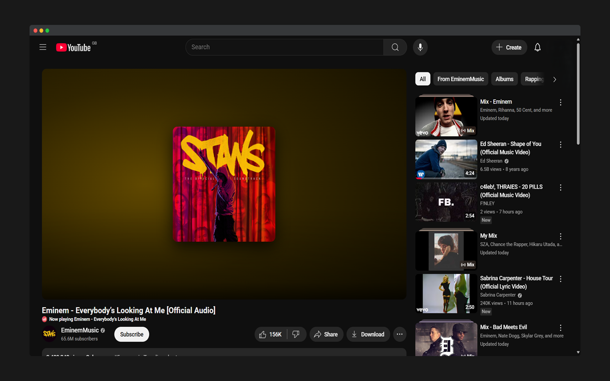
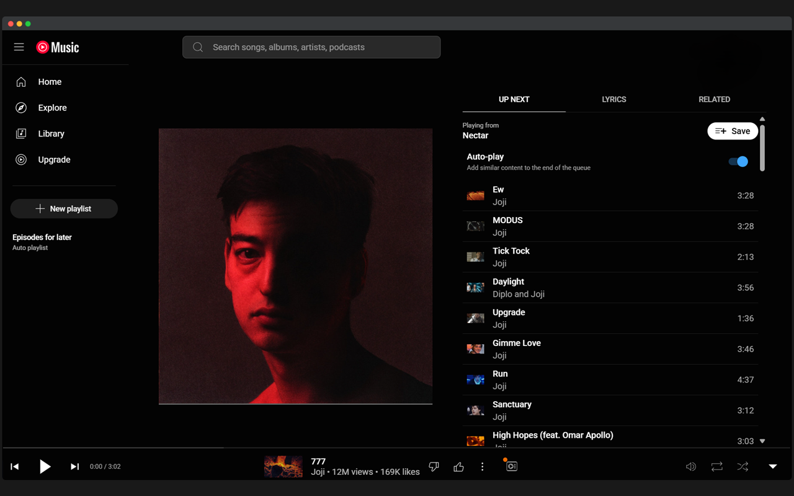

# Video To Album Cover

## Description
Video To Album Cover is an extension for Youtube Music that removes pesky videos and shows the music cover instead to provide less distractions.

## Screenshots

## Download
- Currently not available on chrome store or firefox store.
- Can only be installed through GitHub

## Manual Installation
### Chromium 
1. Download the zip file from the repositry
2. Visit Spotify API and create an account
3. Create an API - you will be provided the client ID and client secret

4. Make a congfig.js file and include the client ID and secret 
5. Visit the extensions page of the browser
6. Enable "Developers mode" and unpack this folder

## Usage
1. Open [YT Music](music.youtube.com) and play a music video
2. Album cover should appear instead of a video 

## FAQ

### Shows the wrong album cover to the track?

The title of some songs might not be recognised by the API to fetch the album cover. You can report this on the GitHub repositry with as much detail as possible. Some songs might not have a cover to be included.

